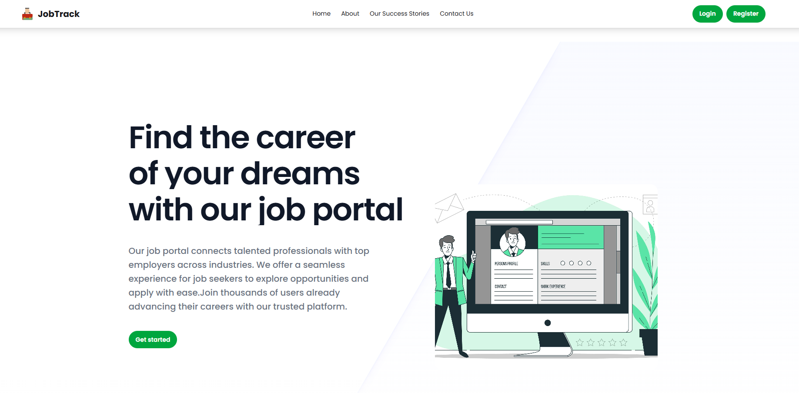
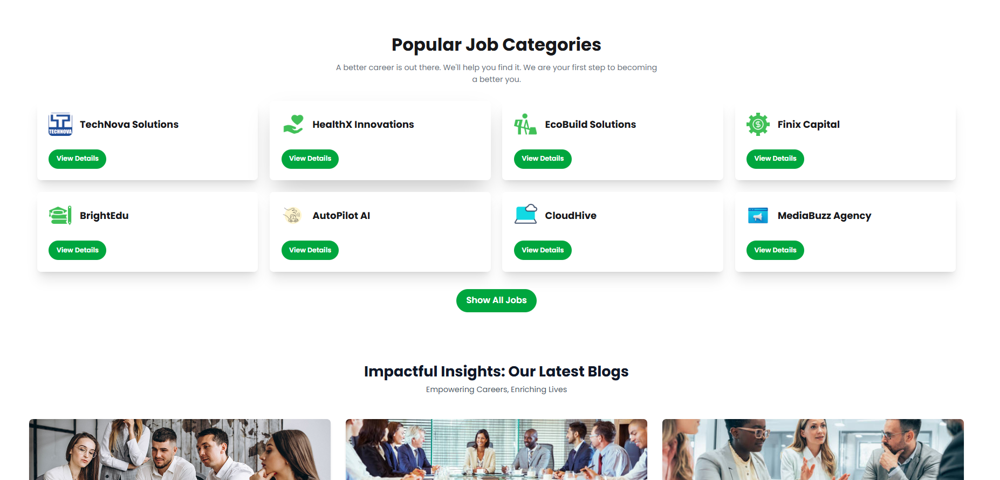

# JobTrack - Your Career Companion 🚀

[](https://ph-jobtrack.netlify.app/)
[](https://reactjs.org/)
[](https://firebase.google.com/)
[](https://tailwindcss.com/)

## 📋 Overview

JobTrack is a modern job portal that connects talented professionals with top employers across industries. Whether you're looking for your dream job or seeking the perfect candidate, JobTrack provides a seamless experience for both job seekers and employers.

## ✨ Screenshots

### Homepage
 

### Dashboard


## 🌟 Key Features

### For Job Seekers
- 🔍 Advanced job search with filters (location, salary, experience level)
- 📊 Personalized job recommendations
- 📝 Easy application tracking system
- 🎯 Resume builder and optimization tips
- 🔔 Job alert notifications

### For Employers
- 🏢 Intelligent candidate matching
- ⚡ Quick job posting interface
- 📈 Applicant management dashboard
- 🔎 Advanced filtering for candidate search
- 💬 Direct messaging system

## 🛠️ Tech Stack

### Frontend
- ⚛️ **React.js** - A JavaScript library for building user interfaces
- 🎨 **Tailwind CSS** with daisyUI components for modern, responsive design
- ✨ **Framer Motion** for smooth animations
- 🔄 **React Router** for seamless navigation
- 📊 **React CountUp** for animated statistics
- 🔍 **React Helmet** for SEO optimization
- 🔮 **Heroicons & React Icons** for beautiful icons

### Backend & Services
- 🔥 **Firebase**
  - Authentication for secure user management
  - Firestore Database for real-time data storage
  - Cloud Storage for media files

## 🚀 Quick Start

1. Clone the repository
```bash
git clone https://github.com/programming-hero-web-course1/b11a9-react-authentication-shafee-ullah.git
```

2. Install dependencies
```bash
npm install
```

3. Start the development server
```bash
npm run dev
```

## 🔗 Links

- [Live Demo](https://ph-jobtrack.netlify.app/)


## 📝 License

This project is licensed under the MIT License - see the [LICENSE](LICENSE) file for details.


